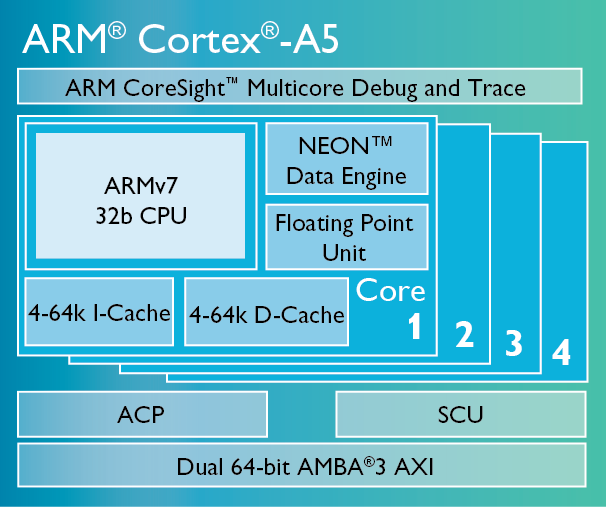

# [Cortex A5](https://github.com/sochub/CA5) 

 

#### 归属：[arm cortex A](https://github.com/sochub/CA)

## [架构描述](https://github.com/sochub/CA5/wiki)

Cortex-A5 处理器是体积最小、能效最高、成本最低的Cortex-A应用处理器，应用领域从低成本的入门级智能手机、特色手机和智能移动终端到应用广泛的嵌入式、消费类和工业设备。

 

Cortex-A5 处理性每个内核达 1.57 DMIPS/MHz，虽然在能性相对于其他 Cortex-A 略差，如只相当于 Cortex-A8 的 80% 性能，Cortex-A15的一半性能，但芯片面积和功耗特性相当出色。Cortex-A5可以支持1~4核，支持双发 dual issue 以及分支预测 branch prediction，NEON和VFP的硬件可选。

Cortex-A5 处理器可为现有的 ARM926EJ-S 和 ARM1176JZ-S 处理器设计提供高价值的迁移途径。它可实现比ARM1176JZ-S 更好的性能，比 ARM926EJ-S 更好的功效和能效，以及 100% 的 Cortex-A 兼容性。Cortex-A5 处理器在指令以及功能方面与更高性能的 Cortex-A8、Cortex-A9 和 Cortex-A15 处理器完全兼容，直到操作系统级别都是如此。Cortex-A5 处理器还保持与 Classic ARM 处理器（包括 ARM926EJ-S、ARM1176JZ-S 和 ARM7TDMI）的向后应用兼容性。

###  [收录芯片](https://github.com/sochub)

* [RDA8810](https://github.com/sochub/RDA8810)

###  [SoC资源平台](http://www.qitas.cn)

